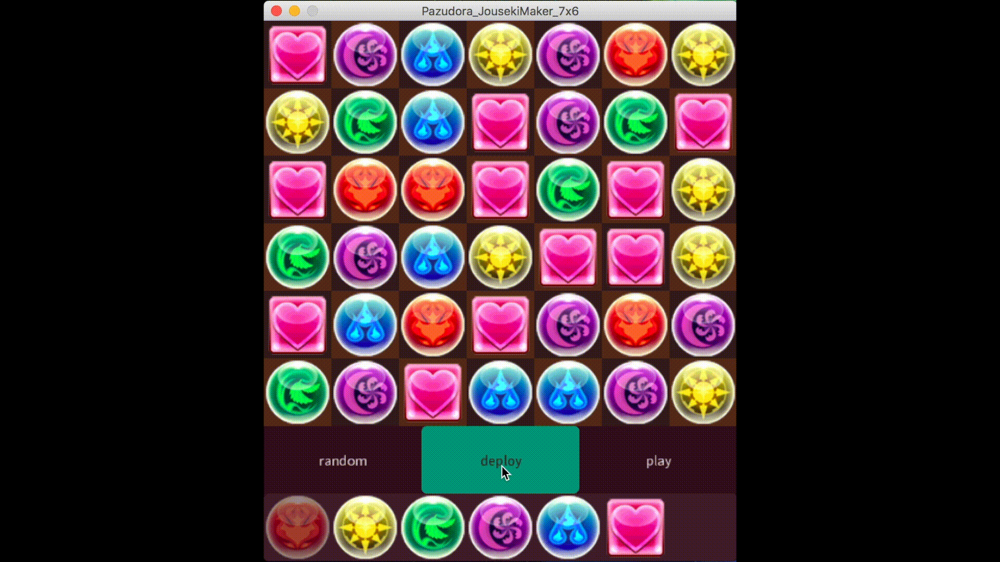
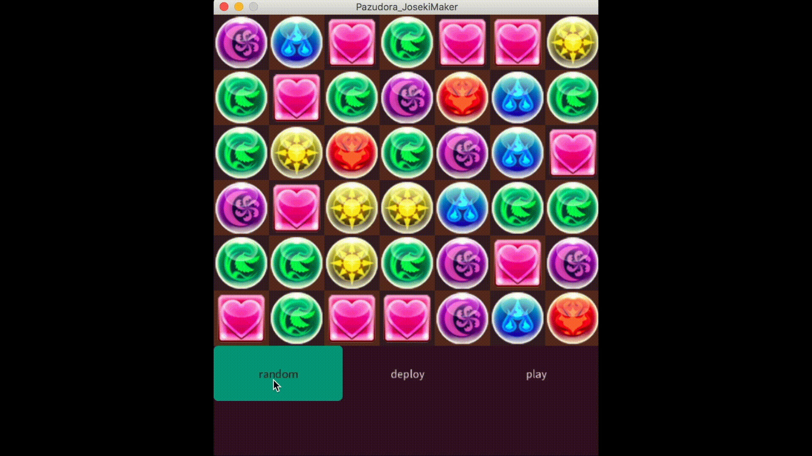

# Pazudora JousekiMaker 7x6 
7x6のパズドラ定石メーカーです。ドロップを自由に配置したり、実際にドロップを消したりして他の定石メーカーのように扱うことができます。
## Dependency
使用言語

- Processing3.3.7

## Usage
1. 下のplayをクリックすると"playモード"になり、マウスでドラッグしてドロップを動かすことができます。操作方法はパズドラと同様です。ドロップを消し終わるとドロップが灰色になって操作ができなくなりますが、マウスをクリックして離すとドロップが全て元どおりになります。

2. deployをクリックすると"deployモード"になりボタンの下から選んだドロップをクリックで好きな場所に配置できます。

3. randomをクリックすると、ドロップがランダムで配置されます。 

## Licence
[MIT](https://github.com/tcnksm/tool/blob/master/LICENCE)

## Authors
[taniharu](https://github.com/Haruya-Taniguchi)

